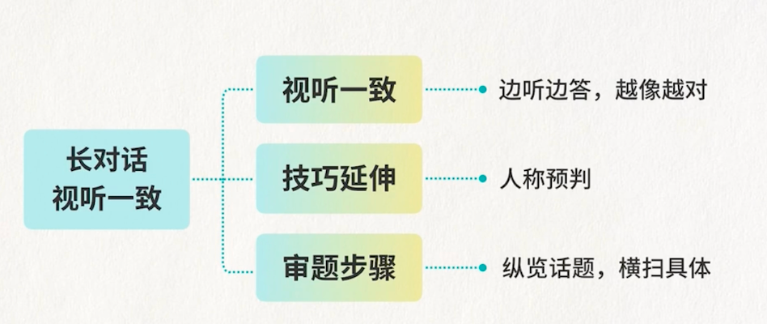

# 六级听力1-长对话听力

## 导学

### 分数分布

总分：710

听力/阅读：248.5分

写作翻译：213分

### 分数要求

180分以上 几乎都能过

150分以上 过级希望乐观

**听力保150争180**

### 方案

备考规划：统筹安排，把握方向

基础能力：词汇能力、做题能力

考试策略：考试经验、答题技巧

### 题型

长对话听力 8% 2分钟 口语化、节奏感强、难度适中

篇章听力 7% 2-2.5分钟 更加书面化，逻辑性强

讲座访谈听力 20% 2.5-3分钟 最重要 书面化、学术化、理解难度高 

### 填答题卡时间

每个题目的导语、题目和题目之间的13秒间隔填答题卡，填完看选项

### 答题策略

听音频的时候就去答题

如果捕捉到音频的内容与选项的内容一样，则直接选

### 核心技巧

视听一致：听到的选项和答案的内容一样

同义替换：看起来不一样，但是表达意思一样

## 视听一致

### 导语

音频内容和选项几乎一摸一样，而且就是正确答案

边听边答、越像越对

### 如何看选项

#### 1.纵览话题

看四个选项里重复最多的那个，就是听力要重点听的部分

题文同序原则，也能让我们知道播到哪一题了

了解相关话题、预判提问的内容、预判人物

By：问方式

Why：问原因

#### 2.横扫具体

横扫选项具体信息、扫读

灵活划取关检测

### 总结

## 同义替换

### 导语

形变意不变，内涵是关键

### 分类

#### 1.同近义替换

#### 2.同根词替换

#### 3.归纳类替换(难)

## 综合替换

### 首末原则

一般在开头或结束有重要的信息点

开头透露话题

结束做出对话的总结、说话者的计划，最后一题可利用

### 互动原则

听问答 抓重复

对话中的问答，一般与问题相关

重要的事情会被反复提到

### 信号词

在对话中出现信号词，说明这个地方可能会有答案

#### 语气词

1.停顿语气

Well, ...

I mean ...

you know ...

as you can see ...

Actually / basically/so...

2.强调语气 留意说话人在强调什么信息

高程度修饰

Too/indeed/really/surely/honestly/absolutely/definitely/obviously/espectially...

极端表达

only/just/all/always/never/most/even...

#### 逻辑词

体现表述逻辑、结构，会分布关键信息

1.让步转折

But/yet/however/while/on the other hand...

though/nevertheless/despite/in spite of/instead of/by contrast...

2.因果关系

because/so/since/due to/the reason why/thanks to/therefore/thus...

3.递进补充

in fact/after that/and then/also/in addition/moreover...

4.解释说明

in other words/that is to say/this/that/which means... this could explain...

5.条件

if/when/which/where...

6.目的

So that/aim at/this is for

